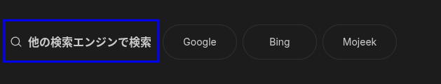
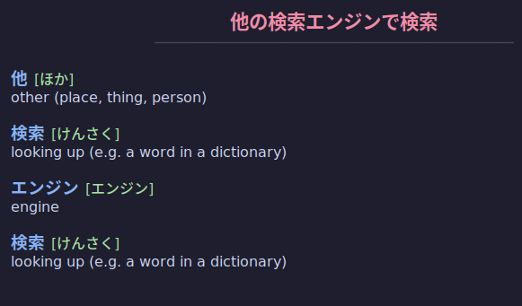

# DeskOCR

DeskOCR is a lightweight, system-native Japanese OCR and dictionary lookup tool for Linux. 

Built for window managers (like AwesomeWM) and desktop environments across both X11 and Wayland, it allows users to instantly freeze their screen, select a region of Japanese text, and receive a parsed breakdown of the characters, readings, and definitions via a minimal UI.

## ⚙️ How It Works (Architecture)

To ensure instant screen captures, DeskOCR uses a client-server architecture:
* **The Daemon (`daemon.py`):** Runs continuously in the background via a systemd user service. It keeps heavy machine-learning OCR models and dictionary databases loaded in memory. It also hosts a system tray icon for easy lifecycle management.
* **The Client (`client.py`):** A lightweight trigger script meant to be bound to a keyboard shortcut. It utilizes native Linux screenshot tools (`maim` for X11, `slurp`/`grim` for Wayland) to grab a screen region and pipes the image to the daemon via a Unix socket. 

## 🛠️ Technologies Used

* **Language:** Python 3
* **UI & System Integration:** `tkinter` (UI), `pystray` (System Tray), `socket` (IPC), Systemd (Daemon management).
* **OCR Engine:** `manga-ocr` (Transformer-based optical character recognition).
* **NLP & Dictionary:** `janome` (Morphological analysis/tokenization), `jamdict` (JMdict and KanjiDic2 querying).
* **Display Server Support:** X11 and Wayland.

## 🚀 Installation Guide

### 1. System Prerequisites
Ensure you have the required system dependencies installed for your display server and font rendering:

```bash
# Ubuntu/Debian example
sudo apt install python3-tk fonts-noto-cjk 

# If on X11:
sudo apt install maim

# If on Wayland:
sudo apt install grim slurp
```
### 2. Clone and Setup Environment
You must use your system's native Python binary to ensure `tkinter` connects properly with `libxft` for CJK font rendering. We use `uv` for fast dependency management.

```bash
git clone https://github.com/kelsbor/DeskOCR.git
cd DeskOCR

# Create a venv strictly using the system Python
uv venv --python /usr/bin/python3 --system-site-packages
source .venv/bin/activate

# Install dependencies (including the dictionary database and system tray)
uv pip install -r requirements.txt
```
### 3. Installation
Run the included installation script. This will package the files into your `~/.local` directories, create an executable wrapper, and set up the background systemd service.

Save the following as `install.sh` in the project root, make it executable (`chmod +x install.sh`), and run it.

### 4. Window Manager Configuration (AwesomeWM)
To make DeskOCR useful, bind the executable to a keyboard shortcut in your Window Manager.

Example for rc.lua in AwesomeWM:
``` Lua
awful.key({ modkey, "Shift" }, "s",
    function ()
        awful.spawn.with_shell("~/.local/bin/deskocr")
    end,
    {description = "DeskOCR Screen Capture", group = "launcher"}
),
```
Reload AwesomeWM, press the shortcut and the translation UI will appear.

### Example
- Example of UI text
---


- Result achieved after scanning the selected text
---
